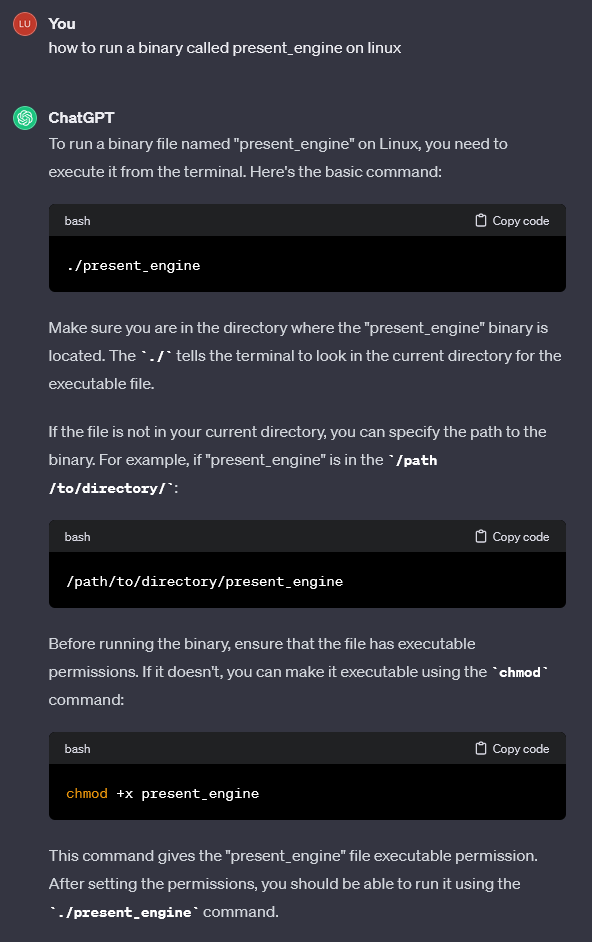

# Linux 101

I did this with ChatGPT mainly to see how well it would be able to help.
I originally did this without obviously, but I thought this would at least
measure the usefulness of ChatGPT in case I would forget some commands.

```bash
Type "yes" to begin: yes
```
-----
```
Perform a directory listing of your home directory to find a troll and retrieve a present!
```


```bash
cd ~
ls
```
-----
```
Now find the troll inside the troll.
```


```bash
cat troll_19315479765589239
```
-----
```
Great, now remove the troll in your home directory.
```


```bash
rm troll_19315479765589239
```
-----
```
Print the present working directory using a command.
```


```bash
pwd
```
-----
```
Good job but it looks like another troll hid itself in your home directory. Find the hidden troll!
```


```bash
ls -a
```
-----
```
Excellent, now find the troll in your command history.
```


```bash
history
```
-----
```
Find the troll in your environment variables.
```


```bash
env
```
-----
```
Next, head into the workshop.
```


```bash
cd workshop
```
-----
```
A troll is hiding in one of the workshop toolboxes. Use "grep" while ignoring case to find which toolbox the troll is in.
```


```bash
grep -i "troll" *
```
-----
```
A troll is blocking the present_engine from starting. Run the present_engine binary to retrieve this troll.
```


```bash
chmod +x present_engine
./present_engine
```
-----
```
Trolls have blown the fuses in /home/elf/workshop/electrical. cd into electrical and rename blown_fuse0 to fuse0.
```


```bash
cd electrical
mv blown_fuse0 fuse0
```
-----
```
Now, make a symbolic link (symlink) named fuse1 that points to fuse0
```


```bash
ln -s fuse0 fuse1
```
-----
```
Make a copy of fuse1 named fuse2.
```


```bash
cp fuse1 fuse2
```
-----
```
We need to make sure trolls don't come back. Add the characters "TROLL_REPELLENT" into the file fuse2.
```


```bash
echo "TROLL_REPELLENT" >> fuse2
```
-----
```
Find the troll somewhere in /opt/troll_den.
```


```bash
find /opt/troll_den -type f -iname "*troll*"
```
-----
```
Find the file somewhere in /opt/troll_den that is owned by the user troll.
```


```bash
find /opt/troll_den -type f -user troll
```
-----
```
Find the file created by trolls that is greater than 108 kilobytes and less than 110 kilobytes located somewhere in /opt/troll_den.
```


```bash
find /opt/troll_den -type f -size +108k -size -110k
```
-----
```
List running processes to find another troll.
```


```bash
ps aux
```
-----
```
The 14516_troll process is listening on a TCP port. Use a command to have the only listening port display to the screen.
```


```bash
netstat -tuln | grep 'LISTEN'
```
-----
```
The service listening on port 54321 is an HTTP server. Interact with this server to retrieve the last troll.
```


```bash
curl http://localhost:54321
```
-----
```
Your final task is to stop the 14516_troll process to collect the remaining presents.
```


```bash
pkill 14516_troll
```
-----


I guess this part acts as some kind of statement &#x1F60E;
