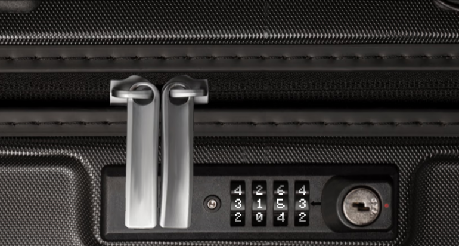

# Luggage Lock

This task was pretty simple: I applied pressure to the lock little by little,
increasing at every point. At each point, I tried to find the number that had
the most resistance to rotating it. Eventually I was able to find the points
with the most resistance, and those ended up being the right numbers.

