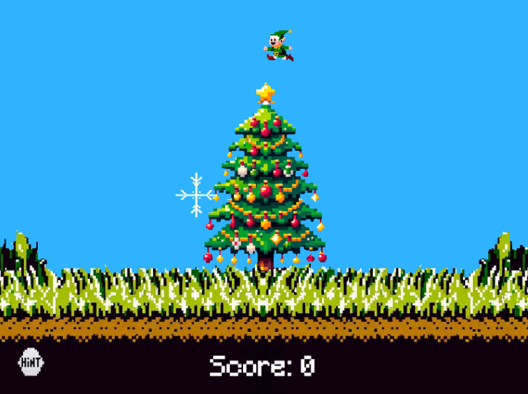

# Elf Hunt

For this one, the elves are way too fast to shoot. The speed was controlled
by a JWT token found in the cookies with the following content:

```json
"header": {
  "alg": "none",
  "typ": "JWT"
},
"payload": {
  "speed": -100
}
```

Changing the speed to a suitable number makes shooting the elves possible.
I think I used like -500 to make them sufficiently slow but not too slow that
it didn't take ages.

