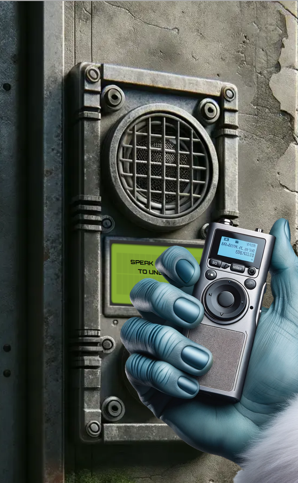

# Space Island Door Access Speaker

For this challenge, the objective was to mimic Wombley Cube's voice
and use the passphrase from the previous task. The correct phrase was:

```
And he whispered, 'Now I shall be out of sight;
So through the valley and over the height.'
And he'll silently take his way.
```

Wombley helpfully gave an audiobook, that could be used with an AI to
simulate his voice. I used a free voice AI to achieve this called 
[Speechify](https://myvoice.speechify.com/). The file I used to open
the door is included in this directory.


