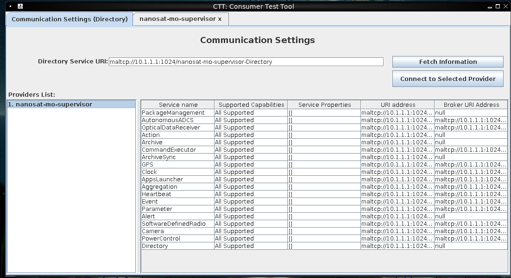
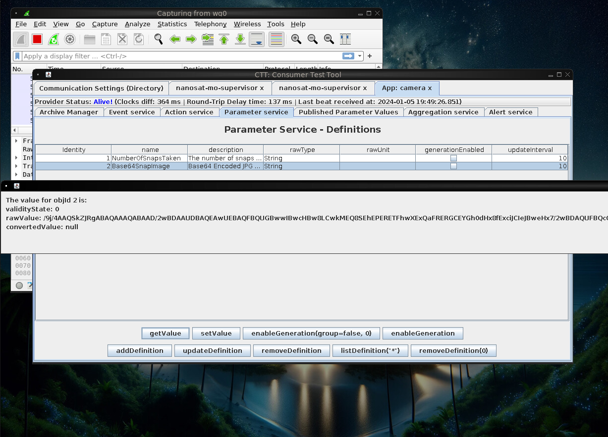
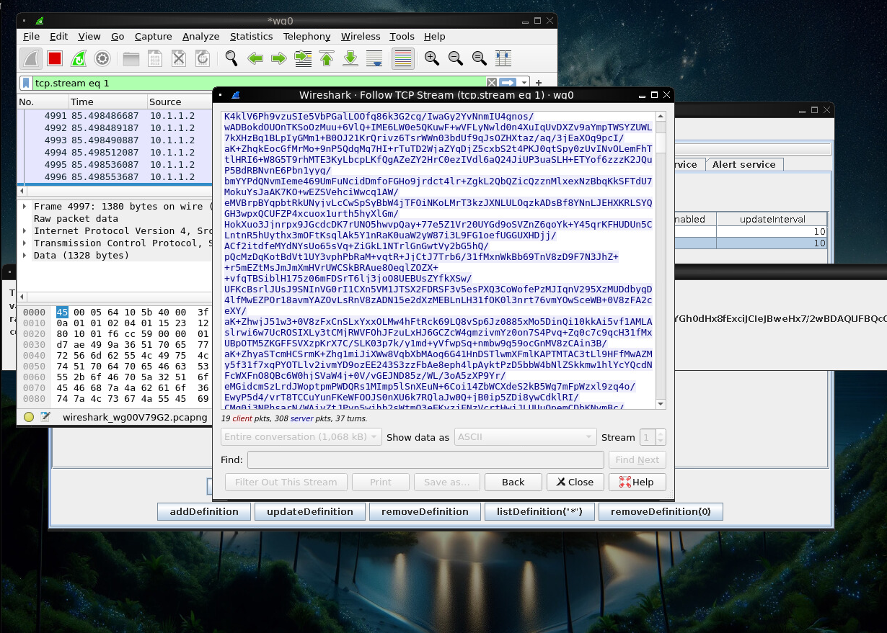

# Camera access

After the initial setup detailed in the files given for the challenge, and
obtaining the client config from the very helpful (and cute) GateXOR, I was
able to connect to the Nanosat GUI, which looks like the following:



Running the camera app gave an address for the camera:
maltcp://10.1.1.1:1025/camera-Directory

In the camera app, there was an action called "Base64SnapImage", and running
it gave the following result:



Running WireShark in the background, I was able to capture and filter out the
long base64 message:



It was just a matter of saving it to a file inside the VM now, and copying it 
out of the Docker container with the command

```bash
docker cp 25d34c9c14d0:/root/capture.pcapng .
```

After this it was just a matter of trimming the output a little, and converting
the base64 into an image. I used an online tool to achieve this. The result
gave me this image:


Which has the flag needed to complete this task: "conquer holiday season!".